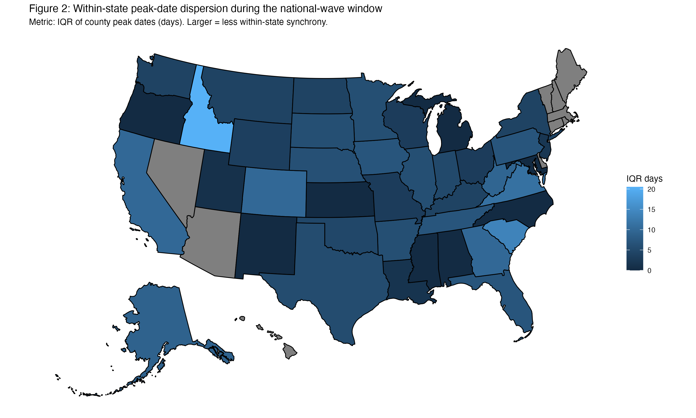
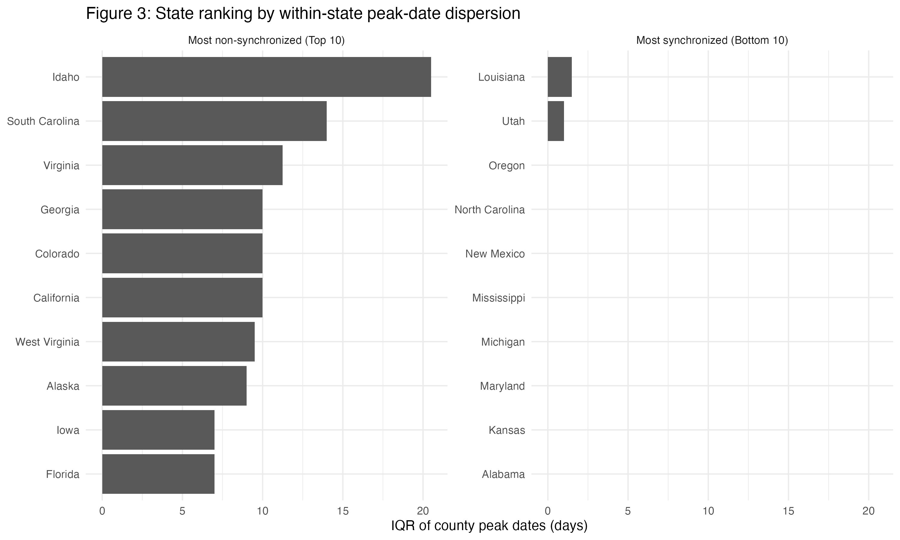
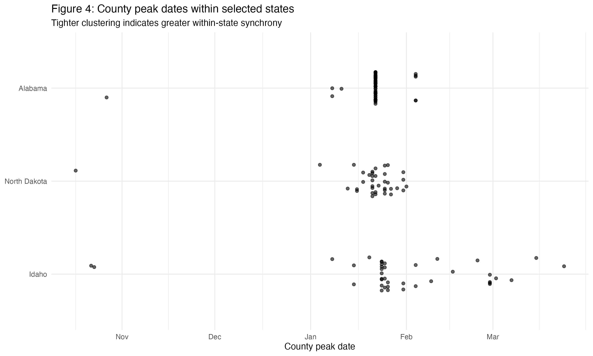

# COVID-19 Peak Synchrony Across U.S. States (County-Level)

## What this project does
Quantifies how synchronized county-level COVID-19 case peaks were *within each U.S. state* during a national-wave window.  
I compute a state-level **dispersion metric** (IQR of county peak dates, in days): **larger IQR = less within-state synchrony**.

## Data
This project uses county-level COVID-19 time series data provided as part of a course dataset (not redistributed in this repo).  
See `data/README.md` for instructions.

## Methods (high-level)
- Construct 7-day rolling average case series
- Define each county’s peak date within a fixed national-wave window (±90 days)
- Aggregate county peak dates to state-level dispersion using **IQR (days)**
- Visualize results via map, ranking, and case studies

## Key results (2–3 takeaways)
- Within-state peak timing varies widely: the state-level IQR of county peak dates ranges from **near 0 days** (high synchrony) up to **~20.5 days** (low synchrony).  [oai_citation:0‡Final-Project_Liang-Hong_lh4195.pdf](sediment://file_00000000060071fda3242deb353d5f22)
- **Idaho** shows the largest within-state dispersion (**IQR = 20.5 days**), followed by **South Carolina (14.0)** and **Virginia (11.25)**, indicating substantially less synchronized county peaks.  [oai_citation:1‡Final-Project_Liang-Hong_lh4195.pdf](sediment://file_00000000060071fda3242deb353d5f22)
- The most synchronized states (e.g., **Louisiana** and **Utah**) have IQR values **close to 0**, and the case study contrasts **Idaho (widely spread peaks)** vs. **Alabama (tight late-January cluster)** with **North Dakota** in between.  [oai_citation:2‡Final-Project_Liang-Hong_lh4195.pdf](sediment://file_00000000060071fda3242deb353d5f22)

---

## Figure 2 — State-level peak-date dispersion (IQR days)

## Figure 3 — Ranking (Top 10 vs Bottom 10)

## Figure 4 — Case study (county peak dates within selected states)

---

## Report
- Live HTML report (GitHub Pages): https://liang020.github.io/r-programming-project/

## Reproducibility (summary)
Open `Final_Project.rmd` and run the analysis end-to-end.  
Figures are exported to `figures/` via `ggsave()` calls in the Rmd.